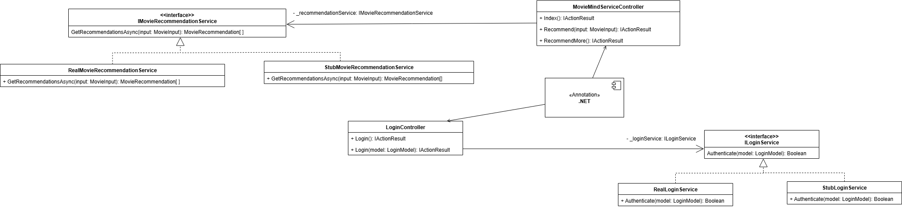
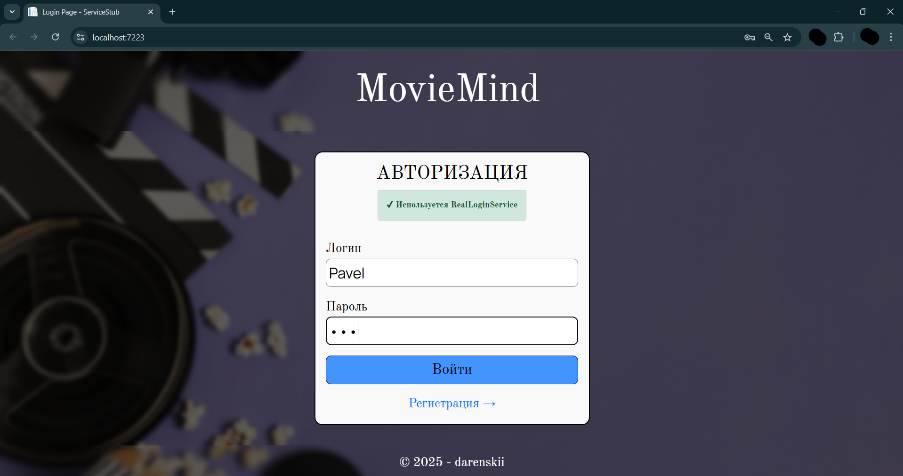
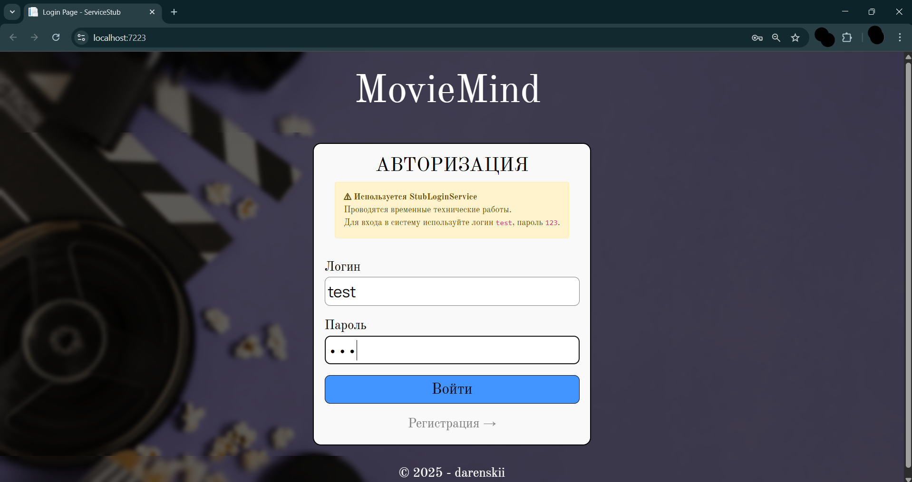
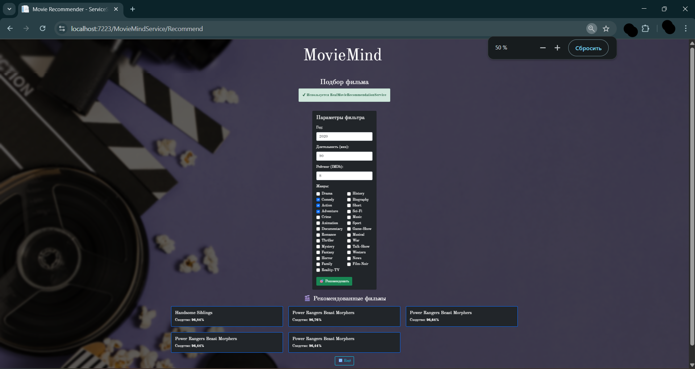
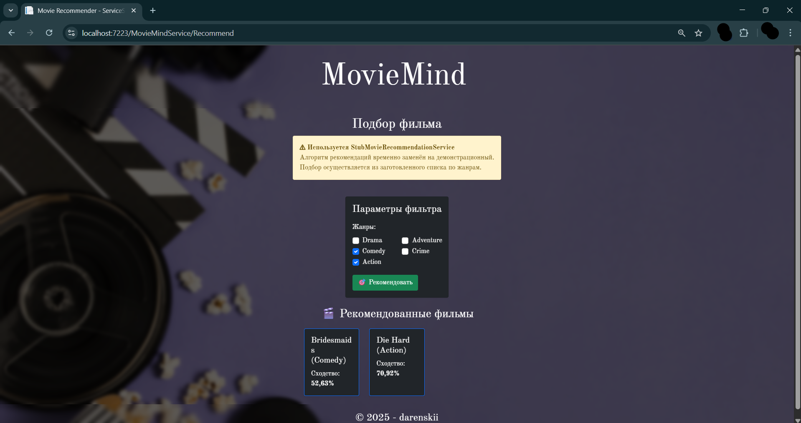

# 🎬 MovieMind_StubServicePattern

ASP.NET MVC web application demonstrating the **Stub Service** architectural pattern for flexible development and testing.  
ASP.NET MVC веб-приложение, демонстрирующее применение архитектурного паттерна **«Фиктивная служба»** для гибкой разработки и тестирования.

---

## 📌 About / О проекте

🎓 Developed as part of an Object-Oriented Analysis and Design (OOAD) course.  
💡 Implements **Stub Service** to enable running the application without real database or API connections.  
🎯 Includes user authentication and movie recommendation features.  
🖥 Built with **ASP.NET MVC + C#** and integrated with external Flask API for recommendations.

🎓 Разработано в рамках курса по ООАП.  
💡 Реализован паттерн **«Фиктивная служба»**, позволяющий запускать приложение без подключения к реальной БД или API.  
🎯 Содержит функционал авторизации и рекомендации фильмов.  
🖥 Построено на **ASP.NET MVC + C#** с интеграцией внешнего Flask API для рекомендаций.

---

## 🔧 Problem & Solution / Проблема и решение

### ❌ Initial problem / Исходная проблема
- При тестировании требовалось подключение к реальной БД и API рекомендаций.  
- Отсутствие этих ресурсов мешало автономной разработке.  
- Нельзя было быстро отключить сложную логику для демонстрации интерфейса.

### ✅ Applied solution / Реализованное решение
- Введён **уровень абстракции** для сервисов:
  - **ILoginService** — авторизация.
  - **IMovieRecommendationService** — рекомендации фильмов.
- Реализованы по две версии каждого сервиса:
  - **Real** — работа с реальными ресурсами.
  - **Stub** — упрощённая заглушка для автономной работы.
- Переключение между реализациями осуществляется через настройки (`appsettings.json`) и внедрение зависимостей (DI).

---

## 🎯 Features / Возможности

- 🔑 **Login system with switchable backends**  
  Авторизация с выбором реализации (реальной или заглушки)
- 🎥 **Movie recommendations from API or local stub**  
  Рекомендации фильмов с API или из заглушки
- ⚙ **Configuration-based service switching**  
  Переключение сервисов через `appsettings.json`
- 🧪 **Isolated UI & logic testing**  
  Изолированное тестирование интерфейса и логики
- 🖥 **ASP.NET MVC + Dependency Injection**  
  Использование ASP.NET MVC и внедрения зависимостей
- 🛠 **Team-friendly for development & demos**  
  Удобно для командной разработки и демонстраций

---

# 🎬 Модуль рекомендаций фильмов (KNN + Flask API)

Модуль реализует систему рекомендаций фильмов на основе алгоритма **KNN (k-ближайших соседей)** с метрикой косинусного сходства.  
Система принимает характеристики желаемого фильма (год, рейтинг, длительность, жанры) и возвращает список наиболее похожих фильмов.

---

## 📌 1. Предварительная обработка данных
- Заполнение пропущенных значений:
  - `certificate` — модой.
  - `duration` — средним значением (с удалением `"min"` и переводом в `int`).
  - `rating` — средним значением.
  - `votes` — средним значением (с удалением запятых и переводом в `int`).
- Очистка года:
  - Извлечение первого года из строки.
  - Удаление некорректных значений.
  - Преобразование в `int`.
- Добавление категории `old/new` (до 2000 года и после).
- Разделение жанров на отдельные значения (`explode`).

---

## 📌 2. Подготовка признаков
- Числовые признаки: `year`, `duration`, `rating` стандартизируются (`StandardScaler`).
- Категориальные признаки (`genre`) кодируются через `MultiLabelBinarizer` (One-Hot Encoding).
- Объединение числовых и категориальных признаков в единый вектор.
- Фильтрация выбросов:
  - `duration` от 30 до 240 мин.
  - `year` от 1930 до 2025.

---

## 📌 3. Модель
Используется:
python
NearestNeighbors(n_neighbors=5, metric='cosine')

---

## 📁 Structure / Структура

### Authentication / Авторизация
- `ILoginService` — interface for login check  
  Интерфейс для проверки логина
- `RealLoginService` — validates against database  
  Проверка через БД
- `StubLoginService` — accepts only `test/123` without DB  
  Принимает только `test/123` без БД

### Movie Recommendations / Рекомендации фильмов
- `IMovieRecommendationService` — interface for recommendations  
  Интерфейс получения рекомендаций
- `RealMovieRecommendationService` — fetches from Flask API  
  Получение от Flask API
- `StubMovieRecommendationService` — returns fixed random list by genre  
  Возвращает фиксированные случайные фильмы по жанру

### Controllers / Контроллеры
- `LoginController` — uses `ILoginService`  
  Использует `ILoginService`
- `MovieMindServiceController` — uses `IMovieRecommendationService`  
  Использует `IMovieRecommendationService`

---

## 📊 Results / Результаты

- 📌 Возможность запуска без БД и API.
- 📌 Быстрое переключение реализаций без изменения кода контроллеров.
- 📌 Упрощённая демонстрация интерфейса.
- 📌 Лёгкое модульное тестирование.

**Example effect / Пример эффекта:**  
🔄 Переключение между **Stub** и **Real** сервисами одной настройкой в конфиге.  
🛠 Интерфейс и логика тестируются независимо от инфраструктуры.

## 🖼 Screenshots / Скриншоты

  
*Рис. 1 — Паттерн «Фиктивная служба» в архитектуре программы*

  
*Рис. 2 — Страница с авторизацией/регистрацией (Реальный сервис)*

  
*Рис. 3 — Страница с авторизацией/регистрацией (Фиктивный сервис)*

  
*Рис. 4 — Страница с рекомендацией фильмов (Реальный сервис)*

  
*Рис. 5 — Страница с рекомендацией фильмов (Фиктивный сервис)*

---
